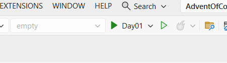
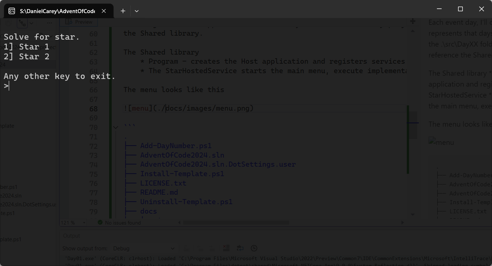

# [AdventOfCode2024]( https://adventofcode.com/2024 )

My Advent of Code 2024 workspace.

This project is **NOT** production-grade and should be treated as a playground. I normally participate
in the Advent of Code using [LINQPad]( https://www.linqpad.net/ ) snippets but wanted to share 
with a broader group.


### AdventTemplate

I created the 'dotnet new advent' template to quickly stand up a project for each day
of the event. Over the course of the event, the template may (will) be
updated to include any helpers or references. To make it easier to install/uninstall, I added these PowerShell
scripts.

#### Install the advent template
```powershell
.\Install-Template.ps1

The following template packages will be installed:
   S:\DanielCarey\AdventOfCode2024\src\AdventTemplate\Content

Success: S:\DanielCarey\AdventOfCode2024\src\AdventTemplate\Content installed the following templates:
Template Name                             Short Name  Language  Tags
----------------------------------------  ----------  --------  --------------
Daniel Carey Advent Application Template  advent      [C#]      Common/Console
```

#### Uninstall the advent template
```powershell
.\Uninstall-Template.ps1

Success: S:\DanielCarey\AdventOfCode2024\src\AdventTemplate\Content was uninstalled.
```

#### Using the template

The template is specific to this solution and project structure. It contains project
references based on this file layout. Once installed, it can be invoked like this from
the solution/root folder.

```powershell
dotnet new advent -o .\src\Day03
```

### Add-DayNumber.ps1

This helper script creates the project using the advent template and 
adds the project to the solution. 

```powershell
.\Add-DayNumber.ps1 03
```

### Solution folder structure

Each event day, I'll create a new project that represents that days'
challenge. It will appear in the .\src\DayXX folder. The daily projects' reference
the Shared library. 

The goal is to quickly start solving the problem by editing
the IStar methods for Star1 and Star2,
```csharp
public ValueTask RunAsync()
```

The Shared library 
    * Program - creates the Host application and registers services including the StarHostedService
    * The StarHostedService starts the main menu, execute implementation loop.

```
.
├── Add-DayNumber.ps1
├── AdventOfCode2024.sln
├── AdventOfCode2024.sln.DotSettings.user
├── Install-Template.ps1
├── LICENSE.txt
├── README.md
├── Uninstall-Template.ps1
├── docs
│   └── images
└── src
    ├── AdventTemplate
    │   └── Content
    │       ├── DanielCarey.AdventTemplate.csproj
    │       ├── Data1.txt
    │       ├── Data2.txt
    │       ├── Program.cs
    │       ├── Star1.cs
    │       └── Star2.cs
    ├── Day01
    │   ├── Data1.txt
    │   ├── Data2.txt
    │   ├── Day01.csproj
    │   ├── Program.cs
    │   ├── Star1.cs
    │   └── Star2.cs
    └── Shared
        ├── Extensions.cs
        ├── IStar.cs
        ├── Program.cs
        ├── README.md
        ├── Shared.csproj
        └── StarHostedService.cs
```

### Solving the problem

#### Running the project

Each day can be ran by selecting the project. After running the 
project, you can select the star (1 or 2) to solve.



#### The menu loop

The menu runs in a loop. Pressing 1 will run the code for solving Star1
and pressing 2 will run the code for solving Star2. Any other key
will terminate execution.



**Happy Coding**

### Reference Material

[Advent of Code]( https://adventofcode.com/ )

[LINQPad]( https://www.linqpad.net/ )

[Apis of .NET - System.Collections.Generic]( https://apisof.net/catalog/27f39504fd636cd000067f4478eda8e6 )

[Apis of .NET - System.Collections]( https://apisof.net/catalog/e874655c0d14d5c42c6a42435dcd71dc )

